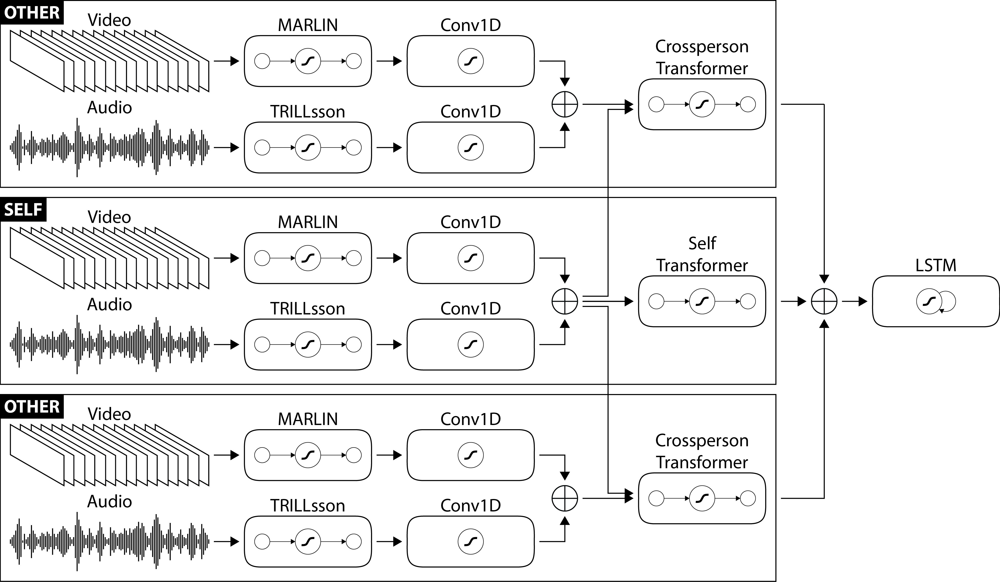

# Participation Role-Driven Engagement Estimation of ASD Individuals in Neurodiverse Group Discussions

  
  

This repo is the official PyTorch implementation for the paper 
[Participation Role-Driven Engagement Estimation of ASD Individuals in Neurodiverse Group Discussions](https://) (ICMI 2024).
